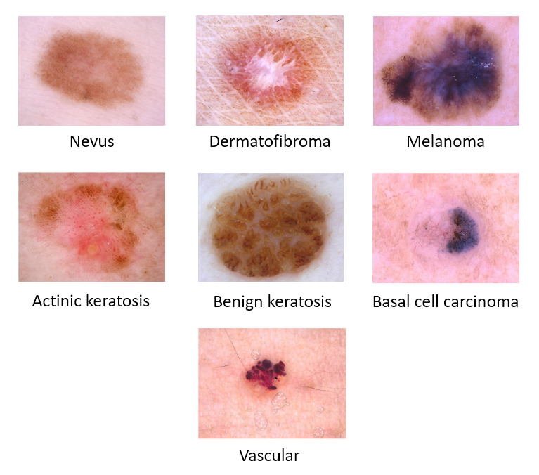
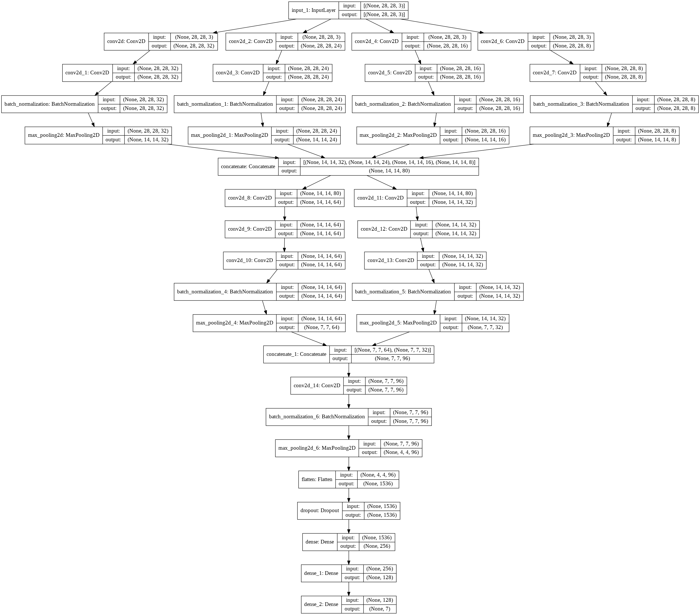
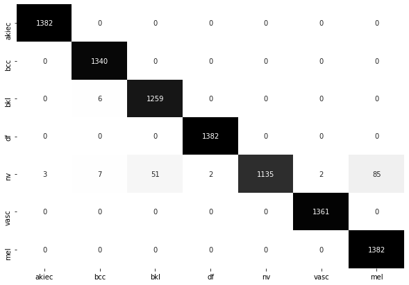
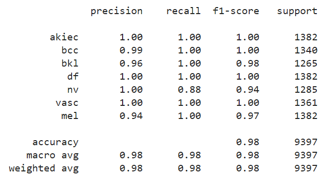

# DeMe-Net
### A CNN architecture to Diagnosis of Dermatology Melanoma Skin Cancer using parallel convolution.
### The DeMe Net architecture is achieves 98.33% accuracy on testing data and 99.85% on the traininge detaset.

### We used the HAM10000 dataset from Kaggle, which was published by ISIC for the 2018 ML Challenge.

### The DeMe net architecture used 3x3, 5x5, 7x7, and 11x11 parallel conv2d layar for distributed computing. 

### We have used accuracy, precision, recall and f1-score as performance metrics to test the performance of the model.

